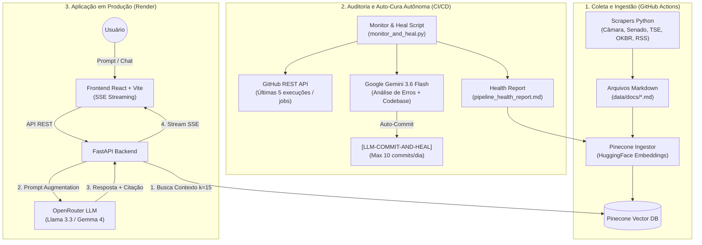

# Como este Projeto Funciona (RAG na Prática)

O projeto implementa uma arquitetura **RAG (Retrieval-Augmented Generation)** conectada a uma API REST (FastAPI) e um frontend em React + Vite, com monitoramento e auto-cura autônomos via CI/CD.

O fluxo é dividido em quatro componentes principais: **Scraping**, **Ingestão**, **Auto-Cura Autônoma (CI/CD)** e **Consulta (API & Web)**.

---

## 1. Etapa de Scraping (`pipelines/scrapers/`)
Objetivo: Coletar e estruturar dados políticos e públicos em arquivos Markdown (`data/docs/`).
- **scraper_camara.py**: Histórico de votações e ementas legislativas.
- **scraper_senado.py**: Proposições e discursos do Senado Federal.
- **scraper_tse_bens.py**: Patrimônio de candidatos e doações de campanha (DivulgaCandContas).
- **querido_diario_scraper.py**: Nomeações, atos e licitações municipais da Open Knowledge Brasil.
- **rss_fact_checking_scraper.py**: Checagens de fatos (G1 Fato ou Fake, Aos Fatos, Estadão Verifica, Agência Pública).

---

## 2. Etapa de Ingestão (`pipelines/ingestion/pinecone_ingestor.py`)
Objetivo: Processar documentos e sincronizar vetores no Pinecone.
1. **Leitura**: Carrega arquivos `.md` da pasta `data/docs/`.
2. **Chunking**: Fatia textos com `RecursiveCharacterTextSplitter` (1000 caracteres / 200 overlap).
3. **Vetorização**: Converte trechos em vetores densos usando HuggingFace Inference API (`sentence-transformers/all-MiniLM-L6-v2`).
4. **Pinecone**: Persiste e atualiza os embeddings no índice em nuvem.

---

## 3. Monitoramento Autônomo e Auto-Cura (`pipelines/ingestion/monitor_and_heal.py`)
Objetivo: Garantir resiliência, sanitizar dados e auto-corrigir falhas de CI/CD diariamente.
- **Auditoria de Dados**: Detecta e purga arquivos truncados ou inválidos em `data/docs/`.
- **Análise de Histórico**: Avalia as últimas 5 execuções de *cada* pipeline de ingestão via GitHub REST API (`/actions/runs` e `/jobs`).
- **Diagnóstico com Contexto Total (`Google Gemini 3.6 Flash`)**: Envia o stack trace de erros emparelhado aos scripts de ingestão e workflows para que o Gemini proponha correções de código autônomas.
- **Governança (`[LLM-COMMIT-AND-HEAL]`)**: Commita apenas correções de alta importância, respeitando uma trava de segurança de até 10 commits por dia.

---

## 4. Etapa de Consulta (`backend/api/` e `frontend/src/`)
Objetivo: Atender requisições dos usuários em tempo real com fontes auditáveis.
1. **Endpoint**: Frontend React faz streaming via Server-Sent Events (SSE) para o FastAPI (`/chat`).
2. **Recuperação Híbrida**: Pinecone busca os vetores mais similares (k=15). Se necessário, realiza busca complementar na web.
3. **Geração (LLM)**: OpenRouter invoca modelos instruídos de alta precisão (ex: Llama 3.3 / Gemma 4), retornando a resposta sintetizada acompanhada dos badges de fontes.
4. **Analytics**: SQLite rastreia e canoniza as perguntas mais populares em um grid de até 8 sugestões.

---

## Fluxo Geral da Arquitetura

