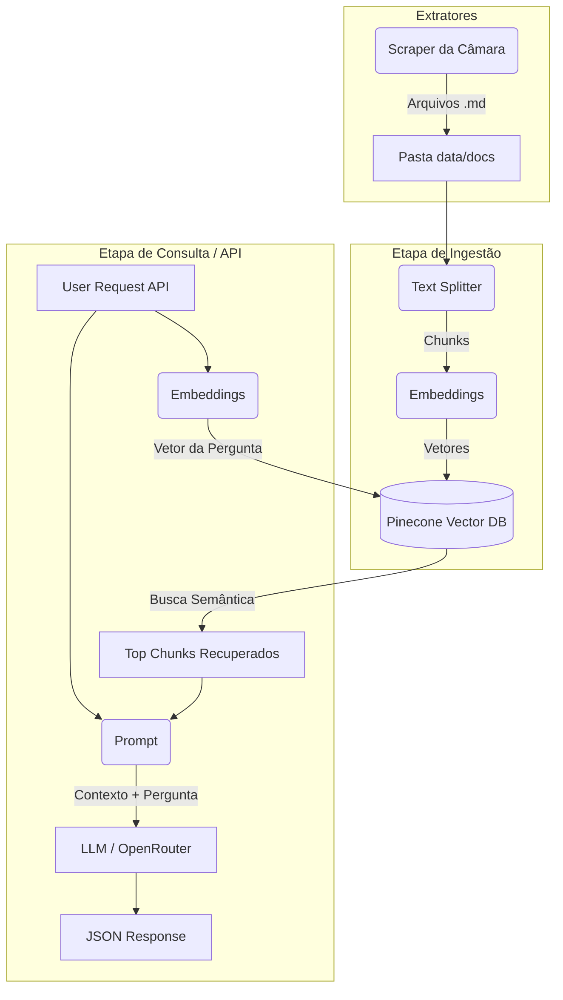

# Como este Projeto Funciona (RAG na Prática)

O projeto implementa uma arquitetura **RAG (Retrieval-Augmented Generation)**, conectada a uma API REST (FastAPI) pronta para deploy no Hugging Face Spaces.

O fluxo é dividido em três etapas principais: **Scraping**, **Ingestão** e **Consulta (API)**.

## 1. Etapa de Scraping (`pipelines/scrapers/scraper.py`)
Objetivo: Coletar dados da vida real (ex: Histórico de Votações da Câmara).
- Conecta em APIs abertas, extrai dados cruciais, processa as informações e salva o resultado no formato Markdown (`.md`) na pasta `data/docs/`.

## 2. Etapa de Ingestão (`pipelines/ingestion/ingest.py`)
Objetivo: Preparar os documentos e armazená-los no Vector DB (Nuvem).

1. **Carregamento**: Lê os arquivos `.md` da pasta `data/docs/`.
2. **Fatiamento (Chunking)**: O `RecursiveCharacterTextSplitter` quebra os documentos em pedaços menores (1000 caracteres) para respeitar o limite de contexto do LLM.
3. **Vetorização**: Converte chunks em vetores usando o modelo open-source da HuggingFace (`all-MiniLM-L6-v2`).
4. **Armazenamento**: Grava os vetores no **Pinecone** (Vector DB em nuvem). Isso nos permite rodar o backend em servidores gratuitos que resetam o disco local a cada deploy.

## 3. Etapa de Consulta (`backend/api/main.py` e `backend/rag/chat.py`)
Objetivo: Expor a IA em uma API REST.

1. **Endpoint**: O usuário envia um POST para a API com sua pergunta.
2. **Recuperação (Pinecone)**: A pergunta é vetorizada e o Pinecone retorna os top 3 chunks mais similares.
3. **Prompt Augmentation**: O contexto e a pergunta são injetados no prompt.
4. **Geração (LLM)**: O modelo (via OpenRouter) lê o contexto e gera uma resposta precisa.

---
**Resumo do Fluxo:**

