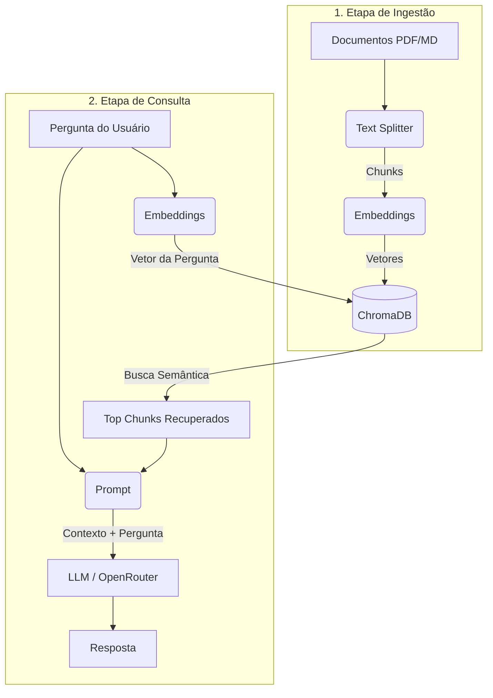

# Como este Projeto Funciona (RAG na Prática)

O projeto implementa uma arquitetura **RAG (Retrieval-Augmented Generation)**, que permite a um modelo de linguagem (LLM) responder perguntas baseado em documentos privados que ele não conhecia durante seu treinamento.

O fluxo é dividido em duas etapas principais: **Ingestão** e **Consulta (Chat)**.

## 1. Etapa de Ingestão (`ingest.py`)
Objetivo: Preparar os documentos e armazená-los de forma que possam ser buscados semanticamente.

1. **Carregamento (Loading)**: Lê os arquivos `.pdf` e `.md` da pasta `docs/`.
2. **Fatiamento (Chunking)**: O `RecursiveCharacterTextSplitter` quebra os documentos em pedaços menores (ex: 1000 caracteres com overlap de 200). Isso é feito porque LLMs possuem um limite de contexto (quantas palavras conseguem "ler" de uma vez).
3. **Vetorização (Embeddings)**: Cada chunk de texto é convertido em um vetor matemático (uma lista de números) usando o modelo open-source da HuggingFace (`all-MiniLM-L6-v2`).
4. **Armazenamento (Vector DB)**: Os vetores são gravados em um banco de dados vetorial local chamado **ChromaDB** (na pasta `chroma_db/`). Textos com significados parecidos terão vetores próximos no espaço vetorial.

## 2. Etapa de Consulta (`chat.py`)
Objetivo: Buscar as informações certas e gerar uma resposta inteligente.

1. **Vetorização da Pergunta**: A pergunta do usuário é transformada em um vetor numérico usando o mesmo modelo de embedding.
2. **Recuperação (Retrieval)**: O sistema busca no ChromaDB os chunks de texto cujos vetores sejam mais próximos (mais parecidos semanticamente) com o vetor da pergunta (retorna o top 3).
3. **Geração Aumentada (Augmentation)**: Os chunks recuperados (o "contexto") e a pergunta do usuário são injetados em um Prompt customizado. 
4. **Geração da Resposta (Generation)**: O prompt recheado de contexto é enviado para o LLM via OpenRouter. O LLM lê o contexto e elabora uma resposta precisa, reduzindo a chance de alucinação.

---
**Resumo do Fluxo:**

